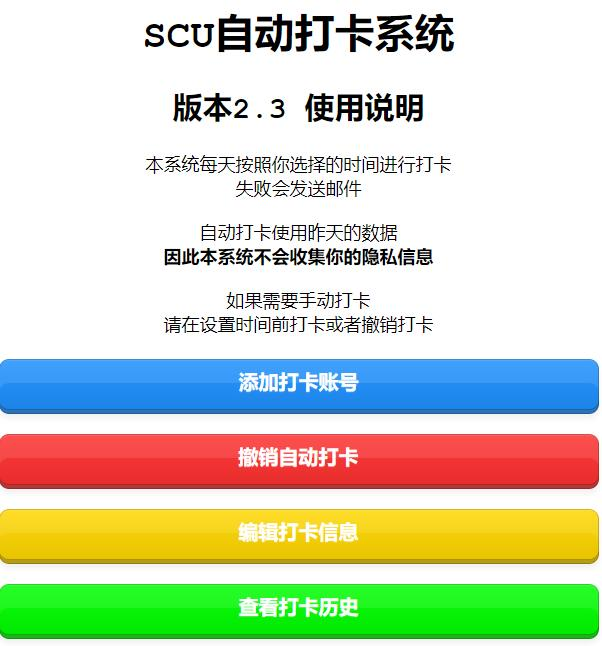

# 四川大学每日健康报自动提交平台



## 平台介绍

1. ##### 本平台是适用于SCU微服务川大健康每日报自动打卡的平台

2. ##### 本平台会保存用户密码（本来想用Cookie的但是不太靠谱）

3. ##### 本平台不保存用户其他信息，信息总是来自于前一天的打卡

4. ##### 如果需要修改打卡数据，请手动打卡一次即可更新打卡信息

## 开源协议

### [GPL v3.0](http://www.gnu.org/licenses/gpl-3.0.html) & [CC BY-NC-SA](https://creativecommons.org/licenses/by-nc-sa/3.0/cn/)

## 安装方法

1. ##### PHP > 7.0

2. ##### Nginx / Apache

   1. #### 把latest 文件内容解压到wwwroot

      #### （宝塔就是解压到你的网站目录）

   2. ##### 编辑Nginx / Apach 配置文件，或者宝塔新建网站

      ##### 设置SSL证书

   ##### 宝塔（可选）

   ##### PhpMyAdmin（可选）

   ##### MySQL >= 5.6

   1. ##### mysqls.sql导入PhpMyAdmin或者数据库

   ##### Proxychains4（强烈推荐）

   ```
   sudo apt update
   sudo apt install proxychains4
   ```

   ##### 配置proxychains

   ```
   sudo vi /etc/proxychains4.conf
   ```

   ##### 	把最后一行的socks4改为socks5，地址改为你的梯子的

3. ##### Python =3.6

   - ##### 推荐使用conda，并取消自动激活

     ```
     sudo su
     conda deactivate
     conda config --set auto_activate_base false
     ```

   - ##### 创建Python环境

     ```
     conda create --name card python=3.6
     ```

   - #### 测试创建的环境

     ```
     conda activate card
     ```

   - ##### 解压文件到网站根目录

     ```
     sudo chmod -R 777 *
     ```

     ##### 修改config.json

     ```
     {
       "db_name": "card_db",
       "db_user": "card_db",
       "db_pass": "card_db",
       "db_host": "127.0.0.1",
       "db_port": 3306
     }
     ```

     ##### 把module内的.EasyOCR文件复制到~/

     ```
     ll
     total 89156
     drwxr-xr-x  9 scurm scurm     4096 Sep 20 14:00 ./
     drwxr-xr-x  4 root  root      4096 Sep  7 04:26 ../
     drwxrwxr-x  4 scurm scurm     4096 Sep 20 13:41 .EasyOCR/
     pwd
     /home/scurm
     ```

   - #### 安装环境包

     ```
     conda activate card	
     pip install -r requirements.txt
     ```

   - #### 去添加账号，测试打卡

     ```
     conda activate card
     python server.py
     ```
   ##### 添加计划任务方式

   ```shell
   # ----------------------------------------------------
   # 自动打卡_清理日志	   正常  每月  每月, 1日 0点 0分执行
   cd /www/wwwroot/card.geekbang.cf/run && rm -rf *
   
   # ----------------------------------------------------
   # 自动打卡_任务00时	正常	每天	每天,     0点10分执行
   killall python3
   killall python
   cd /www/wwwroot/card.geekbang.cf/
   export PATH=/home/scurm/miniconda3/envs/card/bin:$PATH
   python server.py time00 &
   
   # ----------------------------------------------------
   # 自动打卡_任务07时	正常	每天	每天,     7点10分执行 
   killall python3
   killall python
   cd /www/wwwroot/card.geekbang.cf/
   export PATH=/home/scurm/miniconda3/envs/card/bin:$PATH
   python server.py time07 &
   
   # ----------------------------------------------------
   # 自动打卡_任务09时	正常	每天	每天, 9点10分 执行
   killall python3
   killall python
   cd /www/wwwroot/card.geekbang.cf/
   export PATH=/home/scurm/miniconda3/envs/card/bin:$PATH
   python server.py time09 &
   
   # ----------------------------------------------------
   # 自动打卡_任务11时	正常	每天	每天, 11点10分 执行	
   killall python3
   killall python
   cd /www/wwwroot/card.geekbang.cf/
   export PATH=/home/scurm/miniconda3/envs/card/bin:$PATH
   python server.py time11 &
   
   # ----------------------------------------------------
   # 自动打卡_清理进程	正常	每天	每天, 0点0分 执行	
   killall python3
   killall python
   
   # ----------------------------------------------------
   # 自动打卡_静默打卡	停用	每月	每月, 1日 0点0分执行
   killall python3
   cd /www/wwwroot/card.geekbang.cf/
   export PATH=/home/scurm/miniconda3/envs/card/bin:$PATH
   python server.py nomail &
   
   # ----------------------------------------------------
   # 自动打卡_邮件发送	停用	每月	每月, 1日 0点0分执行
   killall python3
   cd /www/wwwroot/card.geekbang.cf/
   python notice.py '标题' '内容' False 起始学号 停止学号
   
   killall python3
   killall python
   export PATH=/home/scurm/miniconda3/envs/card/bin:$PATH
   cd /www/wwwroot/card.geekbang.cf/
   
   python notice.py '【自动打卡】自动打卡系统已经恢复啦' \
   '<br/>你好，SCU自动打卡系统经过了两个月的下线之后<b>已经修复完成</b>，现在已经恢复啦
   <br/>但不知道你是否在校，<b>我们关闭了打卡开关</b>，<b>如你还在校，请<a href="https://ex4-card.geekbang.cf:243/set/">点击此处</a></b>，启用打卡
   <br/>注意：我们关闭了成功打卡的邮件通知，因为每天发的太多被认为是垃圾邮件了!!!
   <br/>如果你还要邮件通知/修改信息/取消打卡，请前往<a href="https://card.52pika.cn/">每日健康报自动化打卡平台</a>操作!<br/>
   <h3>此致，<br/>        皮卡丘川大微服务每日健康报自动化打卡平台</h3>' \
   False 0 9999999999999
   ```

## 注意事项

1. ###### 使用自动打卡必须要前一天有打卡记录，否则不会成功（正常情况都有）
2. ###### 撤销打卡的时候会输入学号会删掉对应学号的全部打卡信息，无需多次

## 更新记录

- ### 1.0

  - #### 实现了自动打卡任务

- ### 2.0

  - #### 增加了邮件系统

  - #### 实现了时间选择

  - #### 更换了API地址

  - #### 新增了日志系统

  - #### 更换了MySQL保存数据

- ### 2.1

  - #### 修复了若干问题

  - #### 新增了打卡开关

  - #### 修复了表单提交问题

- ### 2.2

  - #### 修复了一些问题

  - #### 优化了代码逻辑

  - #### 邮件系统改进

  - #### 优化了日志系统

- ### 2.3

  - #### 修复了打卡进程因为网络问题卡住导致整个打卡停止的bug

- ### 2.4

  - #### 新增了图形验证码识别

  - #### 优化了代码逻辑
  
- ### 2.5

  - #### 新增手动打卡开关

  - #### 修复了返回值错误

  - #### 修复了部分错误停止尝试的bug

  - #### 修复了网络问题导致整个打卡停止的新bug

  - #### 修复了异常捕获不完整导致退出的bug

  - #### 新增了验证码确认功能

  - #### 新增了代码保护模块

  - #### 修改了参数设置

  - #### 改进了邮件系统

  - #### 新增了API接口鉴权

## 特别鸣谢

###### Python脚本在@awei的基础上改良而成

